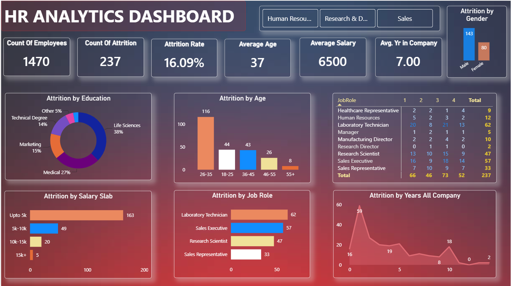

# HR-Analytics-Attrition-Dashboard

An interactive dashboard tracking employee attrition trends, salary impacts, and role-based turnover analytics.

# HR Analytics Dashboard - Employee Attrition & Performance Insights

## 📊 Project Overview
This project features an interactive **HR Analytics Dashboard** designed to help organizations understand the root causes of employee attrition. By analyzing demographic, financial, and role-based data, this dashboard uncovers key trends and patterns driving staff turnover, empowering HR teams to make data-driven decisions to improve employee retention.

---

## 💡 Key Dataset Insights
The dashboard analyzes an organization of **1,470 employees** experiencing an **attrition rate of 16.09%** (237 total departures). The dataset tracks several vital variables:
* **Demographics:** Average age (37 years), gender distribution, and educational backgrounds (Life Sciences, Medical, Marketing, Technical Degrees).
* **Financial Metrics:** Monthly salary slabs (ranging from under $5k to $15k+) and an average overall salary of $6,500.
* **Workplace Tenure:** Average years at the company (7.00 years) mapped against department and individual job roles.
* **Role & Satisfaction:** Attrition broken down across specific positions like Laboratory Technicians, Sales Executives, and Research Scientists.

---

## ❓ Business Problems Identified
An analysis of the dashboard highlights several critical areas of concern for the business:
1. **Low-Income Vulnerability:** A staggering **163 out of 237 attrition cases (68.7%)** occur in the "Up to 5k" salary slab. Low compensation is the primary driver of turnover.
2. **High-Risk Roles:** **Laboratory Technicians (62 departures)** and **Sales Executives (57 departures)** exhibit the highest volume of attrition, pointing to potential burnout, competitive poaching, or structural role dissatisfaction.
3. **Educational Background Triggers:** Employees with backgrounds in **Life Sciences (38%)** and **Medical (27%)** make up the vast majority of departures, suggesting a misalignment in career tracking or retention strategies for technical/scientific talent.
4. **Early-Career Turnover:** Attrition peaks significantly among employees within their **first 1 to 2 years** at the company, indicating potential onboarding gaps or a disconnect between initial job expectations and reality.

---

## 🎯 Business Outcomes & Strategic Recommendations
Using the insights from this dashboard, HR leadership can implement targeted retention strategies:
* **Compensation Restructuring:** Review and adjust the baseline compensation for entry-level roles under the $5k tier to align closer to industry standards, directly targeting the largest source of attrition.
* **Role-Specific Interventions:** Conduct stay-interviews and workload audits for Laboratory Technicians and Sales Executives to address burnout and improve day-to-day job satisfaction.
* **Targeted Onboarding:** Revamp the 30-60-90 day onboarding process to better support new hires, curbing the high turnover seen in the first two years of tenure.

---

## 🛠️ Steps & Methodology (How it Was Built)
1. **Data Cleaning & Transformation:** Handled missing values, standardized data types, and created custom **Salary Slabs** (e.g., Upto 5k, 5k-10k) using conditional columns/DAX to simplify financial profiling.
2. **KPI Formulation:** Developed core metrics including *Total Employee Count*, *Attrition Count*, *Attrition Rate (16.09%)*, and *Average Age (37)*.
3. **Data Visualization:** * Used a Donut Chart for **Attrition by Education** to show proportional breakdowns.
   * Leveraged Bar and Column Charts for **Salary Slabs** and **Job Roles** to easily compare the highest-risk categories.
   * Utilized Matrix tables to cross-examine satisfaction and role dimensions.
4. **UI/UX Design:** Opted for a dark-themed, modern glassmorphism aesthetic with distinct card containers to maximize visual hierarchy and scannability.

---

## 🚀 How to Explore the Dashboard
1. Download the `.pbix` (or appropriate tool file) from this repository.
2. Open it using your local desktop application to interact with the filters (Gender, Department, Age).
